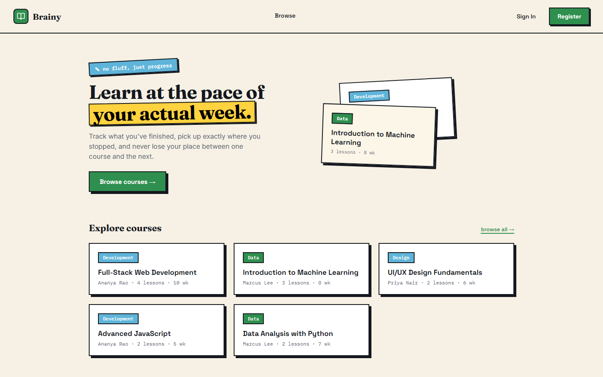
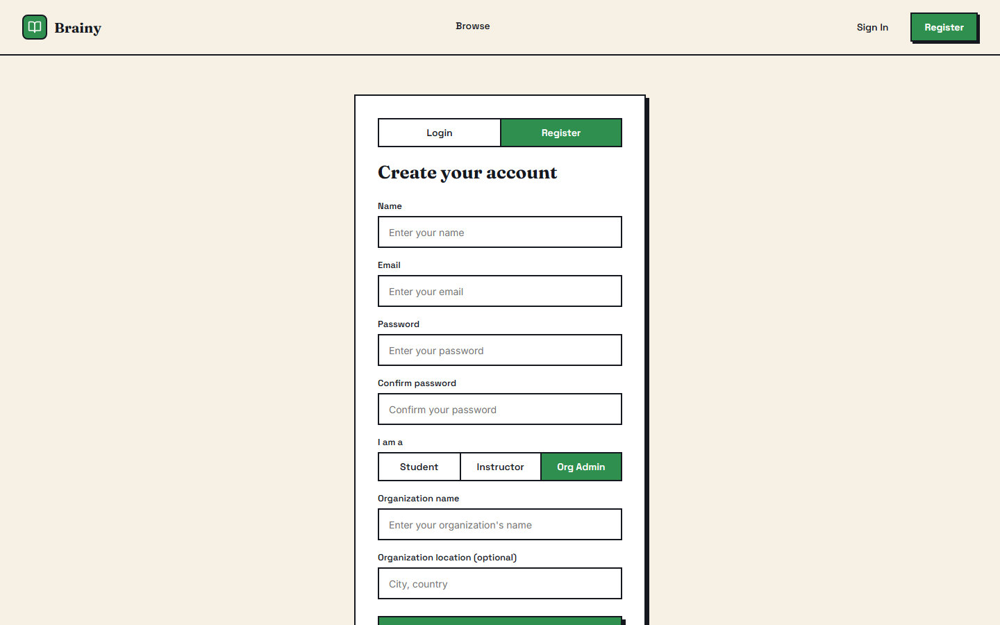
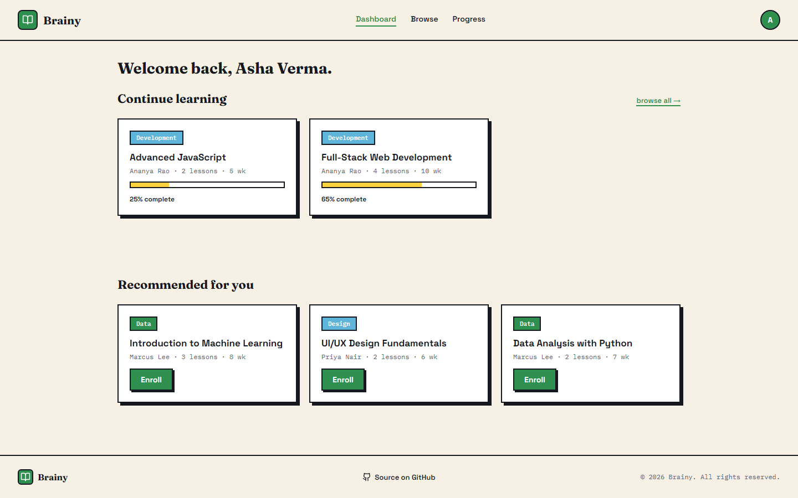
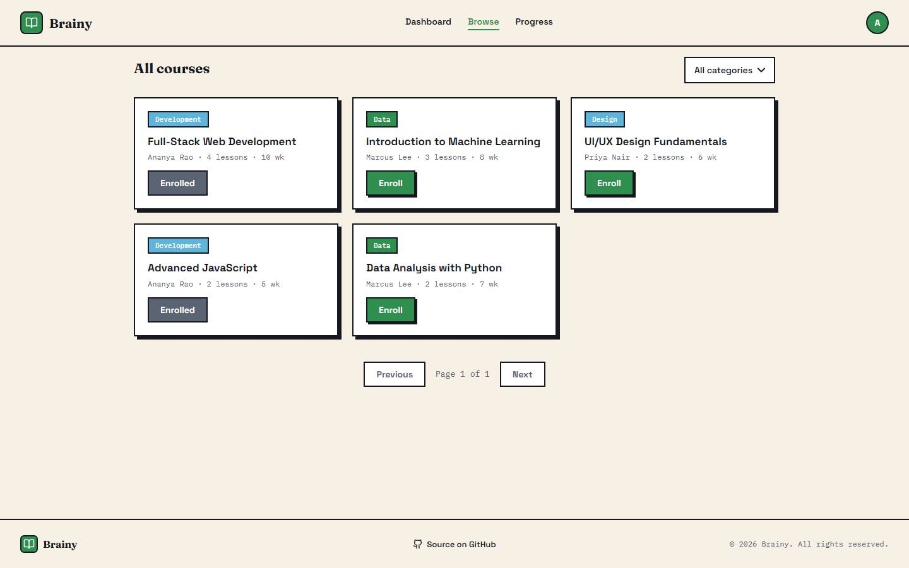
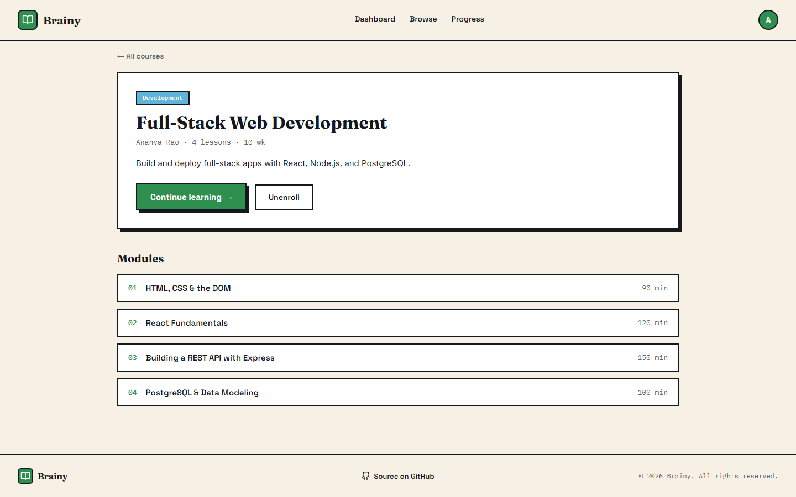

# E-Learning Platform

[](https://github.com/san7iya/e-learning-platform/actions/workflows/ci.yml)

**Live demo:** [brainy-elearning.vercel.app](https://brainy-elearning.vercel.app) — *first load may take ~30s, the free-tier backend spins down after 15 minutes idle*

> Full‑stack E‑Learning Platform (React + Vite frontend, Node.js + Express backend, PostgreSQL)

A Coursera‑inspired project where users can register, log in, browse courses, and access a role-specific dashboard — students track enrollment and progress, instructors manage the courses they teach, and org-admins oversee every course taught within their organization.

---

## Highlights

- **99.6% query time reduction, measured not estimated.** Found a missing index on the join column behind every course listing, seeded 3,000 courses / ~21,000 modules to reproduce it at realistic scale, and benchmarked before/after with both `EXPLAIN ANALYZE` and real end-to-end service calls. See [Query Performance](#query-performance).
- **RBAC as composable middleware, not scattered `if` checks.** Role checks (`requireRole`) and ownership checks (`requireOwnership`) are two independent, stackable Express middlewares — e.g. editing a course requires *both* being an instructor/org-admin *and* owning that specific course — enforced on the backend regardless of what the frontend shows.
- **Three real role-based views, not one dashboard with hidden buttons.** Students, instructors, and org-admins each get a purpose-built `/dashboard` backed by role-scoped SQL (an org-admin's course list is a live join across every instructor in their organization) — not the same page with conditionally-rendered buttons.

### Screenshots

| Landing | Register (org-admin) |
|---|---|
|  |  |

| Student dashboard | Browse courses |
|---|---|
|  |  |

| Course detail |
|---|
|  |

---

## Features

- **Authentication:** Register & login with email/password, passwords hashed with `bcrypt`, JWT issued on login/register and sent as a `Bearer` token. Input validation and rate limiting on auth routes. Self-serve registration for `student`, `instructor`, and `org-admin` — an org-admin registration creates a brand-new `organization` row on the spot, so nobody can self-register as admin of an org they don't run.
- **Role-based dashboards:** `/dashboard` renders a different view per role — students see in-progress courses and recommendations with enroll actions; instructors see the courses they personally teach with enrollment counts and a create/edit CTA; org-admins see every course taught across their organization (read-only, with instructor attribution). Enrollment and progress-tracking UI/routes are hidden entirely from non-students, and the backend enforces the same boundary independently (`requireRole`) so it isn't just a UI restriction.
- **RBAC:** Role- and ownership-gated course create/edit (`student` / `instructor` / `org-admin`), checked as two separate, composable middleware steps (`requireRole`, `requireOwnership`).
- **Course Management:** Courses fetched from PostgreSQL with real category and lesson (module) counts; paginated; filterable by category. Instructors/org-admins can create and edit courses — including a dynamic lesson editor (add/remove/reorder title + duration rows) — through a shared form; a course detail page shows full module listings.
- **Enrollment & Progress:** Real enrollment records tied to each user, with per-course progress tracking and unenroll support (with a confirmation dialog warning that progress is lost).
- **Redesigned Frontend:** A consistent visual system (shared design tokens, bold-border card style, Space Grotesk/Fraunces type) across the landing page, auth screens, header, and course cards, built with React + Vite, a shared `AuthContext`, and role-aware routing (`PrivateRoute`, `RoleRoute`).
- **Backend API:** Express REST API split into routes/controllers/services layers, PostgreSQL (`pg`), CORS enabled, env-based config via `dotenv`.
- **Tests:** backend (`jest`+`supertest`, 26 tests) covers auth (register/login happy + failure paths, org-admin registration), RBAC across course creation, enrollment, and the role-scoped course-listing endpoints, and lesson create/replace/preserve behavior; frontend (`vitest`+React Testing Library, 18 tests) covers `CourseCard`, `CourseForm`'s lesson editor, `AuthContext`, and `PrivateRoute`.
- **Query Performance:** `module.course_id` — the join column used by every course-listing query — was missing an index; measured and fixed, see [Query Performance](#query-performance) below.

---

## Project Structure

```
e-learning-platform/
│
├── backend/
│   ├── app.js           # Express app (exported, no listen()) — used by tests too
│   ├── index.js         # Entry point: imports app.js, calls listen()
│   ├── routes/          # Express routers
│   ├── controllers/     # Request/response handling, validation
│   ├── services/        # DB access + business logic (incl. db.js pool)
│   ├── middleware/      # Auth (JWT), RBAC, rate limiting
│   ├── utils/           # Shared helpers (error handling, validation, JWT)
│   ├── db/              # schema.sql, seed.sql, migrations/
│   ├── benchmark/       # seed.js + queryBenchmark.js — reproducible query perf numbers
│   ├── tests/           # jest + supertest
│   ├── .env.example
│   └── package.json
│
├── docs/
│   └── design/          # Static design reference (final visual direction mockup)
│
├── src/
│   ├── App.jsx
│   ├── main.jsx
│   ├── index.css
│   ├── config.js        # API_BASE constant
│   ├── styles/
│   │   ├── tokens.css    # Shared design tokens (colors, borders, shadows, type)
│   │   └── layout.css    # Shared layout primitives (.section, .grid, etc.)
│   ├── utils/
│   │   └── categoryColor.js
│   ├── test/
│   │   └── setup.js     # vitest + jest-dom setup
│   ├── context/
│   │   ├── AuthContext.jsx       # AuthProvider + useAuth()
│   │   └── AuthContext.test.jsx
│   └── components/
│       ├── landing/
│       ├── auth/         # Login/register form + Toggle switcher
│       ├── header/       # single shared, auth-aware Header
│       ├── footer/
│       ├── profile/      # Profile page (name/email/role)
│       ├── shared/
│       │   └── ConfirmDialog.jsx
│       ├── courses/
│       │   ├── Dashboard.jsx        # Role-branching: Student/Instructor/OrgAdmin views
│       │   ├── AllCourses.jsx       # Browse all courses (category filter, pagination)
│       │   ├── CourseDetail.jsx     # Single course + modules + enroll/unenroll
│       │   ├── CourseCard.jsx / .test.jsx
│       │   ├── CourseForm.jsx / .test.jsx   # Shared form (incl. lesson editor) used by Create/Edit
│       │   ├── CreateCourse.jsx
│       │   ├── EditCourse.jsx
│       │   └── MyProgress.jsx       # Student-only progress tracker + unenroll
│       └── routing/
│           ├── PrivateRoute.jsx     # Requires any authenticated user
│           ├── PrivateRoute.test.jsx
│           └── RoleRoute.jsx        # Requires one of a specific set of roles
│
├── vite.config.js       # @vitejs/plugin-react + vitest config
├── package.json
└── README.md
```

---

## Database Schema (PostgreSQL)

### organization
- `org_id` SERIAL PRIMARY KEY
- `name` VARCHAR(100)
- `location` VARCHAR(255)

### users
- `user_id` SERIAL PRIMARY KEY
- `name` VARCHAR(100)
- `email` VARCHAR(100) UNIQUE
- `password` TEXT
- `join_date` TIMESTAMP
- `role` VARCHAR(20) DEFAULT `'student'` — `student` / `instructor` / `org-admin`, all self-serve at registration
- `org_id` REFERENCES `organization` — set for org-admins (their own org) and, optionally, instructors; new courses inherit this onto the `instructor` row they create

### course
- `course_id` SERIAL PRIMARY KEY
- `title` VARCHAR(255)
- `description` TEXT
- `duration_weeks` INT
- `instructor_id` REFERENCES `instructor`
- `category` VARCHAR(50) — indexed, filterable via `GET /courses?category=`

### instructor
- `instructor_id` SERIAL PRIMARY KEY
- `name` VARCHAR(100)
- `bio` TEXT
- `org_id` REFERENCES `organization` — inherited from the creating user's own `org_id`, if set
- `user_id` UNIQUE REFERENCES `users` — links an instructor row to the login-capable user who owns it, for RBAC ownership checks

### module
- `module_id` SERIAL PRIMARY KEY
- `course_id` REFERENCES `course` — indexed (`idx_module_course_id`), see [Query Performance](#query-performance)
- `title` VARCHAR(255)
- `duration_minutes` INT

### enrollment
- `enrollment_id` SERIAL PRIMARY KEY
- `user_id` REFERENCES `users`
- `course_id` REFERENCES `course`
- `enrollment_date` TIMESTAMP
- `progress_percent` INT
- `UNIQUE (user_id, course_id)` — a user can only enroll in a given course once

---

## Backend API Endpoints

All protected routes expect `Authorization: Bearer <token>`, where `<token>` is the JWT returned by `/register` or `/login`.

### Authentication
- `POST /register` — Register a new user. Body: `{ name, email, password, role? }` (`role` defaults to `student`). If `role` is `org-admin`, also requires `org_name` (`org_location` optional) — a new `organization` row is created and the admin is linked to it in the same transaction. Returns `{ token, user }` — never the password hash.
- `POST /login` — Login. Returns `{ token, user }`.
- `GET /me` — *(auth required)* Returns the current user's fresh profile (name/email/role) for the given token.

### Courses
- `GET /courses` — Public. Query params: `category` (filter), `page`, `limit` (pagination, default `limit=10`, max `50`). Returns `{ courses, pagination: { page, limit, total, totalPages } }`, each course including a real `lessons_count` (from `module`).
- `GET /categories` — Public. Distinct list of course categories, for the browse-page filter.
- `GET /courses/:id` — Public. Full course detail including its modules.
- `GET /recommended-courses` — *(auth required)* Courses the user isn't enrolled in yet, prioritizing categories they're already enrolled in, capped at 4.
- `GET /my-taught-courses` — *(auth required, role: `instructor`)* Courses the logged-in instructor teaches, each with a live enrolled-student count.
- `GET /org-courses` — *(auth required, role: `org-admin`)* Every course taught by instructors in the admin's own organization, with instructor name and enrolled-student count. Returns `[]` if the admin has no courses in their org yet.
- `POST /courses` — *(auth required, role: `instructor`/`org-admin`)* Create a course. Body: `{ title, description?, duration_weeks?, category?, modules? }`, where `modules` is `[{ title, duration_minutes }]`. Rows with a blank title are dropped; the course and its lessons are created in one transaction.
- `PATCH /courses/:id` — *(auth required, role: `instructor`/`org-admin`, and ownership: only the course's own instructor)* Update a course. If `modules` is included, it **replaces** the full lesson list (delete + re-insert, in a transaction); omitting it leaves existing lessons untouched.

### Enrollment
- `POST /enroll` — *(auth required, role: `student`)* Body: `{ course_id }`. `409` if already enrolled, `404` if the course doesn't exist. Instructors/org-admins get `403` — enrollment is a student-only action.
- `GET /my-courses` — *(auth required)* The logged-in user's enrolled courses, joined with real progress.
- `PATCH /enrollments/:id/progress` — *(auth required, ownership: only the enrollment's own user)* Body: `{ progress_percent }` (0–100).
- `DELETE /enrollments/:id` — *(auth required, ownership: only the enrollment's own user)* Unenroll from a course, deleting the progress record.

---

## Backend Setup

Open a terminal, change into the `backend` folder, install dependencies, configure your environment, create the database, and start the server:

```powershell
cd backend
npm install
copy .env.example .env   # then fill in your local DB credentials

# create the database and apply schema + sample data
psql -U postgres -h localhost -c "CREATE DATABASE elearning;"
psql -U postgres -h localhost -d elearning -f db/schema.sql
psql -U postgres -h localhost -d elearning -f db/seed.sql

node index.js
```

`db/schema.sql` is the current schema for fresh installs. `db/migrations/` holds the incremental changes made along the way (role column, instructor↔user link, category column, indexes, enrollment uniqueness, `users.org_id`) — only relevant if you're upgrading an existing database instead of creating a fresh one.

By default the backend runs at: `http://localhost:5000`

### Running tests

```powershell
cd backend
npm test
```

Runs `jest` + `supertest` (26 tests) against the real local database configured in `.env` — auth happy/failure paths, org-admin registration, RBAC across course creation, enrollment, and the role-scoped `/my-taught-courses` and `/org-courses` endpoints, and lesson create/replace/preserve behavior. Safe to re-run — each run generates unique test emails.

---

## Query Performance

`getAllCourses`, `getRecommendedCourses`, and `getMyCourses` each `LEFT JOIN module ON module.course_id = course.course_id` to compute a real `lessons_count`. That join column had no index — only `course.category` and `course.instructor_id` did (migration `005`). At real seed-data scale (a handful of rows) this is invisible; it isn't at a few thousand.

**Measured, not estimated.** `backend/benchmark/` seeds 3,000 courses / 250 instructors / ~21,000 modules, then benchmarks the exact SQL from `getAllCourses` two ways — `EXPLAIN ANALYZE` (pure DB execution time) and an end-to-end call through the real service function (`performance.now()`, including the Postgres round trip) — 1 warm-up + 10 timed runs each, before and after `CREATE INDEX idx_module_course_id ON module(course_id)`:

| Measurement | Before | After | Improvement |
|---|---|---|---|
| DB-level (`EXPLAIN ANALYZE`, avg of 10) | 22.94 ms | 0.09 ms | 99.6% |
| App-level (service call, avg of 10) | 12.30 ms | 1.18 ms | 90.4% |

Why: without the index, Postgres materializes the full `module` table and nested-loop-joins it against every course row, discarding 231,125 non-matching pairs per query (`Seq Scan on module`, confirmed via the actual query plan). With the index, it does one targeted index probe per course instead of scanning the whole table.

One honest caveat: the DB-level number is *higher* than the app-level number in the "before" row, which looks backwards at first glance. That's `EXPLAIN ANALYZE`'s own per-node timing instrumentation adding overhead on a plan with many loop iterations — not a sign the numbers are wrong. The app-level number is the one that reflects what a real request actually experiences.

To reproduce (adds and removes its own clearly-namespaced rows, doesn't touch real data):

```powershell
cd backend
node benchmark/seed.js              # seeds 3,000 benchmark courses (skips if already seeded)
node benchmark/queryBenchmark.js    # prints before/after timings, adds the index permanently
node benchmark/seed.js --clean      # removes benchmark rows only, no re-seed (index stays)
```

The index itself is now permanent — `db/migrations/006_add_module_course_id_index.sql` and `db/schema.sql` both include it, independent of whether you ever run the benchmark.

---

## Frontend Setup

From the repository root install dependencies and start the Vite dev server:

```powershell
npm install
npm run dev
```

Default frontend URL: `http://localhost:5173`

### Pages


| Route | Access | Purpose |
|---|---|---|
| `/` | Public | Landing page |
| `/login`, `/register` | Public | Auth (register supports `student`/`instructor`/`org-admin`, with org name/location fields for org-admin) |
| `/dashboard` | Any authenticated user | Role-specific view (student / instructor / org-admin) |
| `/courses` | Public | Browse all courses, filterable by category |
| `/courses/:id` | Public | Course detail, modules, enroll/unenroll (students) |
| `/courses/new`, `/courses/:id/edit` | `instructor` / `org-admin` | Create / edit a course |
| `/progress` | `student` only | Enrolled courses, progress sliders, unenroll |
| `/profile` | Any authenticated user | Name, email, role |

### Running tests

```powershell
npm test
```

Runs `vitest` (React Testing Library, 18 tests) over `src/**/*.test.jsx` — `CourseCard` rendering/interaction (including instructor-only enrolled-count and edit-link states), `CourseForm`'s lesson editor (add/remove rows, pre-fill on edit, blank-title filtering on submit), `AuthContext` login/logout/session-validation, and `PrivateRoute` redirect behavior. Fully isolated from the network (`fetch` is mocked), so no backend or database needed.

---

## Continuous Integration

`.github/workflows/ci.yml` runs on every push/PR to `main`: it spins up a real Postgres service container, applies `schema.sql` + `seed.sql`, and runs both test suites (26 backend + 18 frontend) — the same commands as above, just automated.

---

## Deployment

Backend and frontend deploy separately. Both platforms below have generous free tiers.

### Backend → Render

This repo includes `render.yaml`, so Render can create the web service *and* a free Postgres database together:

1. Push this repo to GitHub, then in the Render dashboard: **New +** → **Blueprint** → select this repo. Render reads `render.yaml` and provisions both resources.
2. Once the database is up, apply the schema and seed data using its **External Connection String** (from the Render Postgres dashboard), the same way as local setup:
   ```powershell
   psql "<external-connection-string>" -f backend/db/schema.sql
   psql "<external-connection-string>" -f backend/db/seed.sql
   ```
3. `JWT_SECRET` is auto-generated by the blueprint; `DATABASE_URL` is wired automatically from the database. Note your service's URL (e.g. `https://elearning-backend.onrender.com`).

**Free tier caveats:** the web service spins down after 15 minutes of inactivity (first request after that takes ~30s to wake up), and the free Postgres database is deleted after 90 days — fine for demoing to interviewers, not for anything long-lived.

### Frontend → Vercel

1. Import this repo in the Vercel dashboard — it auto-detects the Vite framework preset.
2. Set one environment variable: `VITE_API_BASE` = your Render backend URL from above.
3. Deploy. `vercel.json` (already included) rewrites all routes to `index.html`, so client-side routes like `/dashboard` or `/courses/5` won't 404 on refresh.

### Wire them together

Once you have the Vercel URL, go back to the Render service's environment variables and set `CORS_ORIGIN` to that URL (it's left blank in `render.yaml` on purpose, since it depends on the frontend deploy happening first), then redeploy the backend.

---

## Authentication Flow

1. User registers or logs in → password hashed/verified with `bcrypt`. Registering as `org-admin` also creates a new `organization` row in the same transaction, linked via the new user's `org_id`.
2. On success, the backend signs a JWT containing only `{ user_id, role }` and returns it alongside a `user` object that never includes the password hash.
3. The frontend's `AuthContext` stores the token (and user) in `localStorage`, sends it as `Authorization: Bearer <token>` on subsequent requests, and validates it against `GET /me` once on load.
4. `<PrivateRoute>` gates routes behind "any authenticated user" (e.g. `/dashboard`, `/profile`); `<RoleRoute roles={[...]}>` gates routes behind a specific role set (e.g. `/progress` → `student` only, `/courses/new` → `instructor`/`org-admin`) — both redirect immediately rather than flashing the protected content.
5. Protected backend routes use `requireAuth` (verifies the JWT, sets `req.user`), and role-sensitive routes add `requireRole`/`requireOwnership` on top, checked as separate, composable steps — enforced independently of whatever the frontend shows, so a role restriction is never just a UI-level suggestion.

---

## Tech Stack

- **Frontend:** React.js, Vite, React Router
- **Backend:** Node.js, Express.js
- **Database:** PostgreSQL
- **Auth:** bcrypt, JSON Web Tokens
- **API:** REST
- **Testing:** jest + supertest (backend), vitest + React Testing Library (frontend)


---

## Contributing

Star the repo and feel free to contribute via issues or pull requests. Add a brief description of changes and include any migration or setup steps in your PR.

---

Thank you for checking out the project — happy coding!
